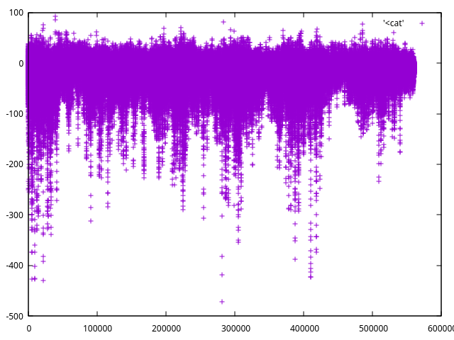

# Parsing the DST (Disturbance storm time index)

## About

[This index](https://wdc.kugi.kyoto-u.ac.jp/dst_final/) of geomagnetic storm strength is valuable but doesn't seem to be very available except as [html pages](https://wdc.kugi.kyoto-u.ac.jp/dst_final/195701/index.html) or more recent but equally absurd [wc format](https://wdc.kugi.kyoto-u.ac.jp/dst_final/202012/dst2012.for.request).

This repository instead does some rudimentary parsing to be able to query their data.

## Tooling

The unix stack: bash, sed, grep, make, gnu parallel

## Usage

Modify the scripts, or use the dst.txt file, which has an line for each hour. See some potential recipes in the makefile.

## Strongest storms

```
$ cat dst.txt | sort -h | head -n 20

-472
-429
-427
-426
-425
-422
-422
-418
-413
-405
-402
-396
-391
-387
-383
-382
-382
-374
-374
-373
```

```
$ grep -r -- "-4[0-9][0-9]" downloads

downloads/195709.html:13    4  35  -1 -54-125-124-177-299 -329-374-427-373-330-287-269-255 -231-200-177-162-152-142-130-120
downloads/195907.html:15   -6 -14 -19 -29 -30 -21 -21 -20   17 -75 -89-119-112-117-128-180 -255-326-391-429-382-336-338-301
downloads/200311.html:20   -4  -6  -5  -7 -15 -26 -32 -34  -17 -38 -68 -58 -49-102-162-171 -229-329-396-413-422-422-405-343
downloads/195802.html:11  -48 -26 -21  -5 -23-114-217-251 -333-402-425-426-373-360-328-309 -293-255-213-213-208-194-191-189
downloads/198903.html:13  -38 -17 -40 -64 -91 -96-128-138 -143 -88-101-231-246-160-183-221 -210-257-257-255-302-382-418-472
downloads/198903.html:14 -583-589-463-386-346-343-252-238 -193-134-126-119-175-156-144-135 -130-122-137-140-115-124-129-114
```


```
$ grep -r -- "-3[0-9][0-9]" downloads

downloads/195709.html:13    4  35  -1 -54-125-124-177-299 -329-374-427-373-330-287-269-255 -231-200-177-162-152-142-130-120
downloads/195907.html:15   -6 -14 -19 -29 -30 -21 -21 -20   17 -75 -89-119-112-117-128-180 -255-326-391-429-382-336-338-301
downloads/200311.html:20   -4  -6  -5  -7 -15 -26 -32 -34  -17 -38 -68 -58 -49-102-162-171 -229-329-396-413-422-422-405-343
downloads/195802.html:11  -48 -26 -21  -5 -23-114-217-251 -333-402-425-426-373-360-328-309 -293-255-213-213-208-194-191-189
downloads/198903.html:13  -38 -17 -40 -64 -91 -96-128-138 -143 -88-101-231-246-160-183-221 -210-257-257-255-302-382-418-472
downloads/198903.html:14 -583-589-463-386-346-343-252-238 -193-134-126-119-175-156-144-135 -130-122-137-140-115-124-129-114
```

## Plot

```
$ cat dst.txt | gnuplot -p -e "plot '<cat'"
```



## Contribution policy

Contributions are welcome. Maybe an easy next step would be to produce a csv with the day an hour, rather than just 

## License

MIT, see LICENSE.txt
